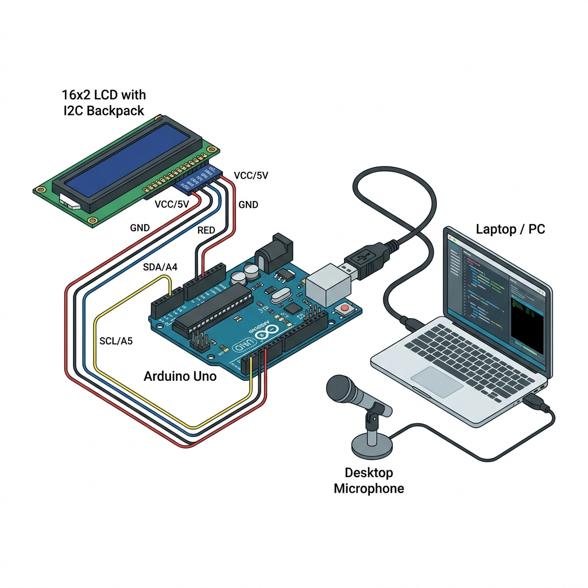

<p align="center">
  
  
  
  
  
</p>

<h1 align="center">AI Desktop Mini Bot</h1>

<p align="center">
  <strong>A voice-controlled AI assistant that lives on your desk.</strong><br/>
  Speak a question &rarr; Gemini thinks &rarr; Answer appears on your LCD.
</p>

<p align="center">
  <a href="#-quick-start">Quick Start</a> &bull;
  <a href="#-how-it-works">How It Works</a> &bull;
  <a href="#-hardware">Hardware</a> &bull;
  <a href="#-wiring">Wiring</a> &bull;
  <a href="#-troubleshooting">Troubleshooting</a>
</p>

---

## Features

- **Voice Input** — Hands-free interaction via any PC microphone  
- **Gemini 2.5 Flash** — Lightning-fast AI responses from Google's latest model  
- **LCD Output** — Answers displayed on a physical 16x2 character display  
- **Real-Time** — Speak and see the response in seconds  
- **Secure Config** — API keys stored in `.env`, never hardcoded  

---

## How It Works

```
    Microphone               Cloud                  Hardware
  +--------------+    +--------------+    +------------------+
  |              |    |  Google STT  |    |                  |
  |  Your Voice  +--->|  (Speech to  +--->|   Gemini 2.5     |
  |              |    |    Text)     |    |   Flash API      |
  +--------------+    +--------------+    +--------+---------+
                                                   |
                                              AI Reply
                                            (<= 30 chars)
                                                   |
                      +--------------+    +--------v---------+
                      |   16x2 LCD   |<---|   Arduino Uno    |
                      |   Display    |    |   (Serial 9600)  |
                      +--------------+    +------------------+
```

| Step | What Happens |
|:----:|:-------------|
| **1** | Microphone captures your voice |
| **2** | Google Speech Recognition converts audio to text |
| **3** | Text is sent to Gemini AI with a 30-char constraint |
| **4** | AI reply is sent over serial (USB) to the Arduino |
| **5** | Arduino prints the reply on the LCD screen |

---

## Quick Start

### Prerequisites

| Requirement | Version |
|:------------|:--------|
| Python | 3.8+ |
| Arduino IDE | 1.8+ or 2.x |
| Gemini API Key | [Get one free](https://aistudio.google.com/apikey) |

### 1 — Clone & Configure

```bash
git clone https://github.com/your-username/sfem172--project-.git
cd sfem172--project-
```

```bash
# Create your local environment file
cp .env.example .env
```

Open `.env` and fill in your values:

```env
GEMINI_API_KEY=your_actual_api_key_here
ARDUINO_PORT=COM5          # or /dev/ttyUSB0 on Linux/Mac
BAUD_RATE=9600
```

> [!CAUTION]
> **Never commit `.env` to git** — it contains your secret API key. The included `.gitignore` already excludes it.

### 2 — Install Dependencies

```bash
pip install -r requirements.txt
```

### 3 — Flash the Arduino

1. Open `arduino/script.cpp` in the **Arduino IDE**
2. Install the **LiquidCrystal_I2C** library via `Sketch > Include Library > Manage Libraries`
3. Select **Board > Arduino Uno** and your **COM port**
4. Click **Upload**

The LCD should display:
```
+----------------+
| ice man        |
| Ready...       |
+----------------+
```

### 4 — Run the Assistant

```bash
python python/script.py
```

Speak into your mic when you see **`Listening...`** — the AI response appears on the LCD!

---

## Hardware

<table>
  <tr>
    <th>Component</th>
    <th>Specification</th>
    <th>Notes</th>
  </tr>
  <tr>
    <td>Arduino Uno</td>
    <td>ATmega328P</td>
    <td>R3, R4, or compatible clones</td>
  </tr>
  <tr>
    <td>16x2 LCD</td>
    <td>I2C interface (PCF8574)</td>
    <td>Address <code>0x27</code> or <code>0x3F</code></td>
  </tr>
  <tr>
    <td>Microphone</td>
    <td>USB or 3.5 mm</td>
    <td>Any PC-compatible mic</td>
  </tr>
  <tr>
    <td>USB Cable</td>
    <td>Type-A to Type-B</td>
    <td>For Arduino-to-PC communication</td>
  </tr>
  <tr>
    <td>Jumper Wires</td>
    <td>Female-to-Female</td>
    <td>4 wires for I2C connection</td>
  </tr>
</table>

---

## Wiring

<p align="center">
  
</p>

```
        Arduino Uno                     I2C LCD Module
       +===========+                  +================+
       |           |                  |                |
       |  5V    o--+------------------+--o VCC         |
       |           |                  |                |
       |  GND   o--+------------------+--o GND         |
       |           |                  |                |
       |  A4    o--+------------------+--o SDA         |
       |           |                  |                |
       |  A5    o--+------------------+--o SCL         |
       |           |                  |                |
       +===========+                  +================+
```

> [!NOTE]
> Pin 13 (built-in LED) flashes as a status indicator when the Arduino receives serial data.

---

## Project Structure

```
sfem172--project-/
|
+-- arduino/
|   +-- script.cpp            # Arduino firmware (serial to LCD)
|
+-- python/
|   +-- script.py             # Voice assistant (mic > Gemini > serial)
|
+-- docs/
|   +-- README.md             # Schematics, images, notes
|
+-- .env                      # Local secrets (git-ignored)
+-- .env.example              # Template for required env vars
+-- .gitignore                # Excludes .env, __pycache__, etc.
+-- requirements.txt          # Python dependencies
+-- README.md                 # You are here
```

---

## Troubleshooting

<details>
<summary><strong><code>GEMINI_API_KEY is not set</code></strong></summary>

Make sure you filled in your key inside `.env` (not `.env.example`).
```env
GEMINI_API_KEY=AIza...your_real_key
```
</details>

<details>
<summary><strong>LCD screen stays blank / no backlight</strong></summary>

Your LCD may use address `0x3F` instead of `0x27`. Change line 6 in `arduino/script.cpp`:
```cpp
LiquidCrystal_I2C lcd(0x3F, 16, 2);  // try this instead
```
</details>

<details>
<summary><strong><code>Error connecting to Arduino</code></strong></summary>

Only one program can use the serial port at a time.  
**Close the Arduino IDE Serial Monitor** before running the Python script.
</details>

<details>
<summary><strong><code>Could not understand the audio</code></strong></summary>

- Move closer to the microphone  
- Reduce background noise  
- Speak clearly and at a normal pace
</details>

<details>
<summary><strong>Wrong COM port</strong></summary>

**Windows:** Open **Device Manager > Ports (COM & LPT)** to find the correct port.  
**Linux/Mac:** Run `ls /dev/tty*` and look for `ttyUSB0` or `ttyACM0`.

Update your `.env`:
```env
ARDUINO_PORT=COM3
```
</details>

---

## Tech Stack

| Layer | Technology | Purpose |
|:------|:-----------|:--------|
| **AI Engine** | [Google Gemini 2.5 Flash](https://ai.google.dev/) | Generate concise answers |
| **Speech-to-Text** | [Google Speech Recognition](https://pypi.org/project/SpeechRecognition/) | Convert voice to text |
| **Microcontroller** | [Arduino Uno](https://www.arduino.cc/) | Receive serial data & drive LCD |
| **Display** | 16x2 I2C LCD | Show AI responses physically |
| **Serial Comm** | [PySerial](https://pypi.org/project/pyserial/) | Python-to-Arduino bridge |
| **Config** | [python-dotenv](https://pypi.org/project/python-dotenv/) | Secure environment variables |

---

## Contributing

Contributions are welcome! Here's how:

1. **Fork** this repository
2. **Create** a feature branch (`git checkout -b feature/amazing-feature`)
3. **Commit** your changes (`git commit -m 'Add amazing feature'`)
4. **Push** to the branch (`git push origin feature/amazing-feature`)
5. **Open** a Pull Request

---

## License

This project is open source and available for anyone to use, modify, and distribute.

---

<p align="center">
  <strong>Built with hardware and a passion for AI</strong><br/>
  <sub>If you found this useful, consider giving it a star</sub>
</p>
